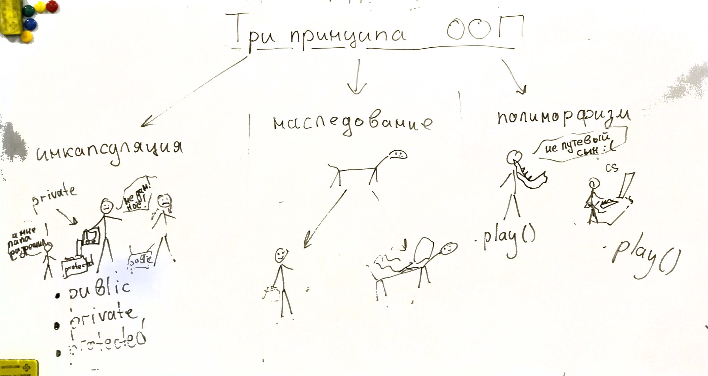

# Занятия 3-4: Три принципа ООП
### Перегрузка функций

В С++ есть возможность создать функции с одинаковым именем для разных типов параметров. Это называется **перегрузкой функции**.

В следующем примере создается две функции abs. Первая функции возвращаем модуль числа, а ее перегруженная версия - длину вектора (отрезок из нуля в точку [x,y]).

```cpp
#include <iostream>
#include <cmath>

struct vec
{
    int x, y;
    vec(int x, int y) : x(x), y(y) {}
};

int abs(int a)
{
    if (a<0) return -a;
    return a;
}
int abs(vec v)
{
    return sqrt(v.x*v.x+v.y*v.y);
}


int main()
{
    vec v(4,3);
    
    std::cout<<abs(-4); // 4
    std::cout<<abs(v); // 5
    
    return 0;
}
```

### Три принципа ООП

Три принципа ООП утверждают, что каждый ООП язык должен поддерживать **инкапсуляцию**, **наследование** и **полиморфизм**.


**Инкапсуляция** позволяет задать уровень доступа для членов класса.

Существует три уровня доступа: **private, protected и public**.
 - Элементы класса в секции private доступны только из методов этого класса.
 - Элементы класса в секции protected доступны только из методов класса и его наследников (об этом позже).
 - Элементы класса в секции public доступны извне.
 
**Наследование** позволяет создать новый класс на основе существующего или, другими словами, унаследовать его. Базовый (тот, который мы расширяем) класс называется **родителем** (parent), а новый - **наследником** (child).

**Полиморфизм** позволяет наследнику изменять поведение родителя. Иными словами, можно пересоздавать методы родителя в наследнике и это не будет ошибкой.

```cpp
#include <iostream>
#include <cmath>

class Dog {
protected: //доступно для наследников
    int hunger; //голод
public:
    Dog() {
        hunger = rand() % 5 + 1;
    }

    void voice() {
        for (int i = 0; i < hunger; i++)
            std::cout << "wow ";
        std::cout << std::endl;
    }
};

class Cat : public Dog //наследуем кота от собаки
{
    int cuttiness; //добавляем милоту, голод уже есть, он достался от собаки
public:
    Cat() {
        hunger = rand() % 5 + 1;
        cuttiness = rand() % 5 + 1;
    }

    void voice() //полиморфизм - мы заменяем метод голос
    {
        for (int i = 0; i < hunger; i++) {
            std::cout << "meo";
            for (int j = 0; j < cuttiness; ++j) {
                std::cout << "w";
            }
            std::cout << " ";
        }
        std::cout << std::endl;
    }
};

int main() {
    Dog Jack;
    Cat Barsik;

    std::cout << "Dog says:" << std::endl;
    Jack.voice();
    std::cout << "Dog says:" << std::endl;
    Barsik.voice();

    return 0;
}
```
**Результат:**
```
Dog says:
wow wow wow 
Cat says:
meowwww meowwww meowwww meowwww 
```
**Примечания:**

1) Конструктор наследника может вызывать конструктор родителя:
```cpp
    Cat() : Dog() {
        cuttiness = rand() % 5 + 1;
    }
```
2) Перегружаемый при полиморфизме метод может обратиться в исходному методу родителя:
```cpp
    void voice()
    {
        Dog::voice();
        //что то еще
    }
```

