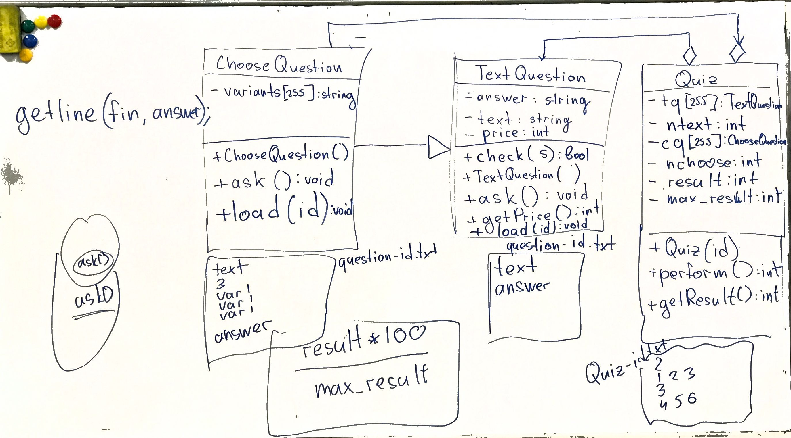
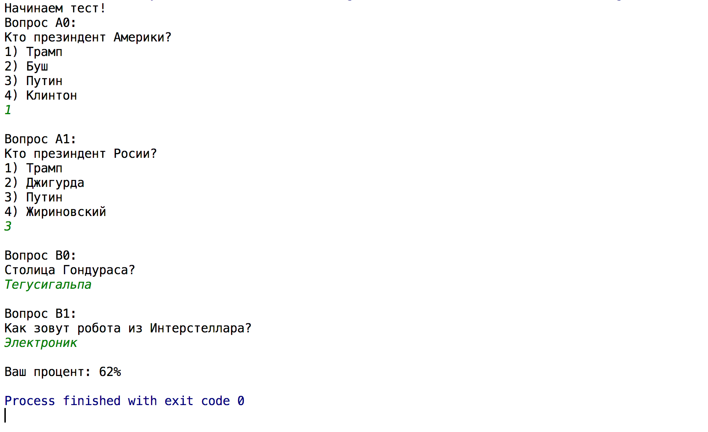

## Постановка задачи

Необходимо реализовать программу для тестирования учащихся с двумя типами вопросов:
  - Вопрос с вариантами ответа (ChooseQuestion).
  - Вопрос с текстовым ответом (TextQuestion).
  
Каждый вопрос может иметь собственный вес в оценке (price).

Вопросы объединяются в тесты (quiz). Каждый тест содержит несколько вопросов с вариантами ответа и несколько без.

Информация о тестах храниться в файле, информация о каждом вопросе также в отдельных файлах.

## Возможная архитектура решения

## Пример работы

